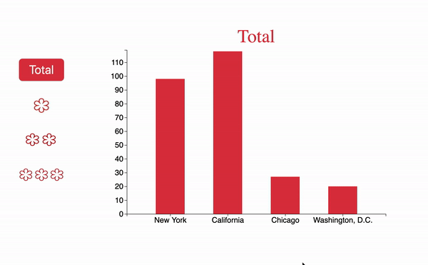

# 

## Background and Overview 

Michelin stars are a rating system used by the red Michelin Guide to grade restaurants on their quality.
Good food always make people happy and bring people together. 

Gourmet is an interactive data visualization website on michelin star restraunts in the world.
Dream big and plan your next special occasion at one of michelin star restraunts! 

## Functionality

In Gourmet, 
* users are able to see the distribution of Michelin star resturaunts across different US regions with an interactive bar graph. 



* users are able to play mini guessing game with an interactive bubble graph. 

 

## Architecture and Technology 

* HTML/CSS
* Javascript
* D3

## Code Highlights 

### Update Function and Ticked function 

I implemented update function to let user pick the data they see in both charts.
Also, in bubble chart, in order to update the position of all of my bubble, I created ```function ticked```. Evert time ```function ticked``` is called, it grabs all the circles and changes its position and added a ```force``` to move circles to the right position.  

```javascript 
function update(datafile, chartname) {
    d3.csv(datafile).then(function (dataset) {

    ...

      const simulation = d3
        .forceSimulation()
        .force("x", d3.forceX(width / 2).strength(0.05))
        .force("y", d3.forceY(height / 2).strength(0.05))
        .force(
          "collide",
          d3.forceCollide(function (d) {
            return radiusScale(d.total) + 45;
          })
        );
    
    ...
     
      simulation.nodes(dataset).on("tick", ticked);

      function ticked() {
        circles
          .attr("cx", function (d) {
            return d.x;
          })
          .attr("cy", function (d) {
            return d.y;
          })
      }

      .... 


```

### Click/Double Click function 

I impremented click and double click function in order to make the chart more interactive. I used ```d3.event.currentTarget.parentElement``` and accessed to the element that user has clicked. 
Also, made sure the chart doesn't show the data that user already clicked by changing ```revealOne = false``` once user has clicked and revealed data. 

```javascript 
 circles
        .on("click", function (d) {
          debugger
          if (revealOne === true) {
            d3.selectAll('.cuisine-texts').remove();
            debugger
            revealOne = false
            const text = d3.select(d3.event.currentTarget.parentElement)
              .append("text")

            text
              .text(d.cuisine)
              .attr("font-size", function (d) {
                if (d.total > 5 || (d.total > 5 && d.cuisine.length < 8)) {
                  return "25px"
                } else if (d.total < 3 && d.cuisine.length > 8 && d.cuisine !== "Gastropub") {
                  return "11.5px"
                }
                return "16px"
              })
              .attr("font-weight", "bold")
              .attr("class", "cuisine-text")
              .attr("fill", "white")
              .attr("x", d.x )
              .attr("y", d.y )
              .style("text-anchor", "middle")
          } else {
            debugger
            d3.selectAll('.cuisine-text').remove();
            revealOne = true;
          }
        })
 ```


### Hover Effect 
I implemented the hover effect to show the data for individual data by creating seperate ```div``` and changed the opacity of the ```div``` depends on the user's mouse is hovering over the chart or not. And implemented ```mouseover``` and ```mouseout``` event handlers inside of 
```.on('end')``` in order to prevent user to interact with data while 
the data is still loading.

```javascript 
     .on('end', function() {
                    d3.select(this)
                        .on('mouseover', function (d, i) {
                            d3.select(this).transition()
                                .duration('50')
                                .attr('opacity', '.85')
                            div.transition()
                                .duration(50)
                                .style("opacity", 1);

                            div.html("# of stars: " + d.total)
                                .style("left", (d3.event.pageX + 10) + "px")
                                .style("top", (d3.event.pageY - 15) + "px");
                        })
                        .on('mouseout', function (d, i) {
                            d3.select(this).transition()
                                .duration('50')
                                .attr('opacity', '1')
                            div.transition()
                                .duration('50')
                                .style("opacity", 0);
                        })
                })
```

