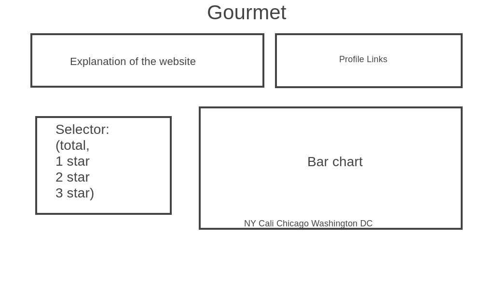
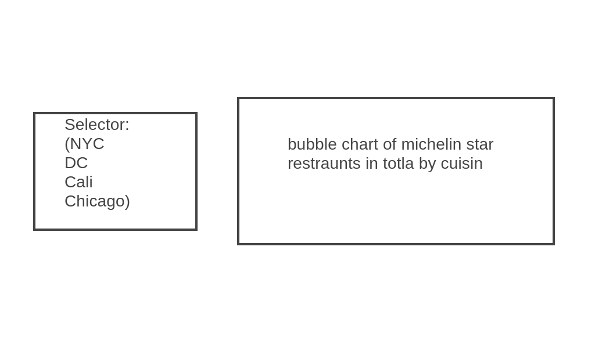

## Background and Overview 

Michelin stars are a rating system used by the red Michelin Guide to grade restaurants on their quality.
Good food always make people happy and bring people together. 

Gourmet is an interactive data visualization website on michelin star restraunts in the world.
Dream big and plan your next special occasion at one of michelin star restraunts! 

## Functionality and MVPs

In Gourmet, users are able to see worldwide michelin star restraunts by continent, country, popular city, and star ratings. 

## Wireframes

## Architecture and Technology 

* HTML/CSS
* Javascript
* D3

## Implementation Timeline

* Phase 1 (Day 1 & 2)
    * Sort data and research on d3
    * Render bar chart (with csv data)
* Phase 2 (Day 3 & 4)
    * Make sure selector for bar chart works 
    * implement bubble chart 
* Phase 3  Day 5
    * Complete HTML and CSS for site elements
    * Production README

## Bonus Feature
* allow users to see all the restraunts when they click bubble chart 